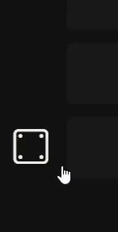

[](https://www.npmjs.com/package/confetti.ts)
[](https://github.com/LoaderB0T/confetti.ts/actions/workflows/build.yml)
[](https://sonarcloud.io/summary/new_code?id=LoaderB0T_confetti.ts)
[](https://bundlephobia.com/package/confetti.ts)

# confetti.ts

Canvas Confetti in TypeScript!

## Motivation 💥

This small package provides some simple particle animations in TypeScript.

## Examples 🧮

<p align="center">
  
  
</p>

## Features 🔥

✅ Spawn particles on your website

✅ Control the size, color, rotation, velocity and acceleration of the particles

✅ Extendable particle shapes (Add your own particles!)

✅ Framework independent

✅ Strongly typed (when using TypeScript)

✅ Fully ESM

✅ Lightweight: Zero dependencies

## Built With 🔧

- [TypeScript](https://www.typescriptlang.org/)

## Getting Started 🚀

```typescript
// Minimal example
import { CircleParticle } from 'confetti.ts';

CircleParticle.draw({
  position: {
    x: 50,
    y: 300
  },
  radius: 20,
  color: 'red'
});

// Moving example
CircleParticle.draw({
  position: {
    x: 100,
    y: 300
  },
  radius: 20,
  color: 'red',
  movementXY: {
    velocity: {
      y: 0.5 // Slowly moves down
    }
  }
});

// Accelerating example
CircleParticle.draw({
  position: {
    x: 150,
    y: 300
  },
  radius: 20,
  color: 'red',
  movementXY: {
    velocity: {
      y: -7, // Moves upwards initially
      x: 1 // Slightly moves right all the time
    },
    acceleration: {
      y: 0.1 // But then "gravity" pulls it down
    }
  }
});

// Example with angled movement
CircleParticle.draw({
  position: {
    x: 200,
    y: 300
  },
  radius: 20,
  color: 'red',
  movementAngle: {
    angle: 35,
    velocity: {
      x: 1
    },
    acceleration: 0.05
  }
});

// Example with rotation
RectParticle.draw({
  position: {
    x: 250,
    y: 300
  },
  width: 20,
  height: 10,
  color: 'magenta',
  rotation: {
    velocity: {
      x: 3,
      z: 4
    }
  }
});


// Adjust global settings

import { setConfettiSettings } from 'confetti.ts';

setConfettiSettings({
  zIndex: 200
});

```

## Playground 🎮

--- TODO ---

## Contributing 🧑🏻‍💻

Contributions are what make the open source community such an amazing place to learn, inspire, and create. Any contributions you make are **greatly appreciated**.

If you have a suggestion that would make this better, please fork the repo and create a pull request. You can also simply open an issue with the tag "enhancement".
Don't forget to give the project a star! Thanks again!

1. Fork the Project
2. Create your Feature Branch (`git checkout -b feature/AmazingFeature`)
3. Commit your Changes (`git commit -m 'Add some AmazingFeature'`)
4. Push to the Branch (`git push origin feature/AmazingFeature`)
5. Open a Pull Request

## License 🔑

Distributed under the MIT License. See `LICENSE.txt` for more information.

## Contact 📧

Janik Schumacher - [@LoaderB0T](https://twitter.com/LoaderB0T) - [linkedin](https://www.linkedin.com/in/janikschumacher/)

Project Link: [https://github.com/LoaderB0T/confetti.ts](https://github.com/LoaderB0T/confetti.ts)
