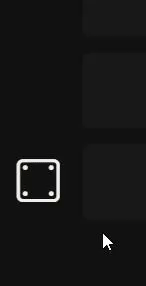

[](https://www.npmjs.com/package/confetti.ts)
[](https://github.com/LoaderB0T/confetti.ts/actions/workflows/build.yml)
[](https://sonarcloud.io/summary/new_code?id=LoaderB0T_confetti.ts)

# confetti.ts

Canvas Confetti in TypeScript!

## Motivation 💥

This small package provides some simple particle animations in TypeScript.

<!-- ## Example 🧮

<p align="center">
  
</p> -->

## Features 🔥

✅ Todo

✅ Framework independent

✅ ESM & CJS exports

✅ Zero dependencies

## Built With 🔧

- [TypeScript](https://www.typescriptlang.org/)

## Getting Started 🚀

```typescript
import { Confetti } from 'confetti.ts';

const confetti = new Confetti();

// todo
```

## Contributing 🧑🏻‍💻

Contributions are what make the open source community such an amazing place to learn, inspire, and create. Any contributions you make are **greatly appreciated**.

If you have a suggestion that would make this better, please fork the repo and create a pull request. You can also simply open an issue with the tag "enhancement".
Don't forget to give the project a star! Thanks again!

1. Fork the Project
2. Create your Feature Branch (`git checkout -b feature/AmazingFeature`)
3. Commit your Changes (`git commit -m 'Add some AmazingFeature'`)
4. Push to the Branch (`git push origin feature/AmazingFeature`)
5. Open a Pull Request

## License 🔑

Distributed under the MIT License. See `LICENSE.txt` for more information.

## Contact 📧

Janik Schumacher - [@LoaderB0T](https://twitter.com/LoaderB0T) - [linkedin](https://www.linkedin.com/in/janikschumacher/)

Project Link: [https://github.com/LoaderB0T/confetti.ts](https://github.com/LoaderB0T/confetti.ts)
